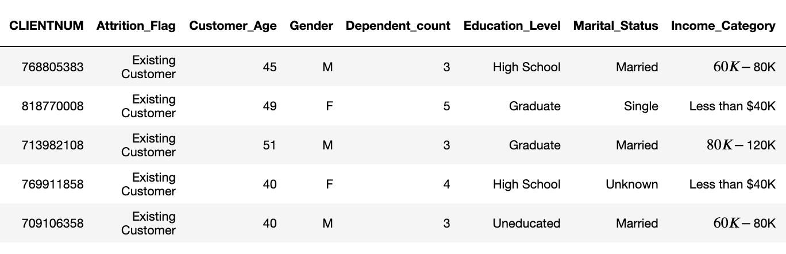

# Predict Customer Churn

- Project **Predict Customer Churn** of ML DevOps Engineer Nanodegree Udacity

## Project Description
In this project, you will implement your learnings to identify credit card customers that are most likely to churn. The completed project will include a Python package for a machine learning project that follows coding (PEP8) and engineering best practices for implementing software (modular, documented, and tested). The package will also have the flexibility of being run interactively or from the command-line interface (CLI).

This project will give you practice using your skills for testing, logging, and best coding practices from this lesson. It will also introduce you to a problem data scientists across companies face all the time. How do we identify (and later intervene with) customers who are likely to churn?

Below are the first few rows associated with the dataset for this project, which was pulled from Kaggle.

## Files and data description
Overview of the files and data present in the root directory. 

#### Project Structure
The project directory structure is organized as follows:

- bankCustomerChurn
  - data
    - bank_data.csv
  - images
    - eds
    - results
    - scores
  - logs
    - churn_library.log
    - test_churn_library.log
  - models
  - churn_library.py
  - churn_logger.py
  - churn_script_logging_and_tests.py
  - conftest.py
  - constants.py
  - churn_notebook.ipynb
  - Guide.ipynb
  - requirements.txt
  - requirements_py3.6.txt
  - requirements_py3.8.txt
  - README.md

## Running Files

To use the churn library, follow these installation steps:

#### To setup virtual env
conda create --name <your env name> python=3.6.3

#### To activate virtual env
conda activate <your env name>

#### Install dependencies
pip instal -r requirements.txt

#### Running Test
pytest churn_script_logging_and_tests.py

When this is run, the testcases in the churn_script_logging_and_tests.py is executed by pytest. This will call the functions from churn_library and execute them and use the results after execution for verification.
This test will also create logs under ./logs directory as :
  - churn_library.log : Has the debugs/error logs from churn_library.py
  - test_churn_library.log  : Has the debugs/error logs from churn_script_logging_and_tests.py

#### Running Program
python churn_library.py

When this is run, churn_library.py is executed. This will call the functions from churn_library and execute them and store the results / images in respective directories.

Below Functions will be executed and respective outcome can  be seen:
 - general_logger : decorator for general logging for entry /exit in and from function
  
 - import_data
    - description : load data from file to dataframe
    - input :
        - pth: a path to the csv
    - output :
        - df: pandas dataframe
  

 - perform_eda
    - description : perform exploratory data analysis and save exploratory images into path: ./images/eda/
    - input : 
        - df: pandas dataframe
    - output : 
        - df: pandas dataframe

 - encoder_helper
    - description : encode categorical features
    - input :
        - df: pandas dataframe
            - category_lst: list of columns that contain categorical features
            - response: string of response name [optional argument that could be used for naming variables or index y column]
    - output :
        - df: pandas dataframe with new columns for

 - perform_feature_engineering
    - description : perform feature engineering
    - input :
        - df: pandas dataframe
        - response: string of response name [optional argument that could be used for naming variables or index y column]
    - output :
        - X_train: X training data
        - X_test: X testing data
        - y_train: y training data
        - y_test: y testing data

 - classification_report_image
    - description : generate classification report image in the path ./images/scores/
    - input :
        - y_train: training response values
        - y_test:  test response values
        - y_train_preds_lr: training predictions from logistic regression
        - y_train_preds_rf: training predictions from random forest
        - y_test_preds_lr: test predictions from logistic regression
        - y_test_preds_rf: test predictions from random forest
    - output : None

 - feature_importance_plot
    - description : fetch important features from dataset and save plots in path ./images/results/
    - input :
        - model: model object containing feature_importances_
        - X_data: pandas dataframe of X values
        - output_pth: path to store the figure
    - output : None

 - train_model
    - description : train the model and dump models in path ./models/
    - input :
        - X_train: X training data
        - X_test: X testing data
        - y_train: y training data
        - y_test: y testing data
    - output : None

## Changelog

>>>>>>> dev
